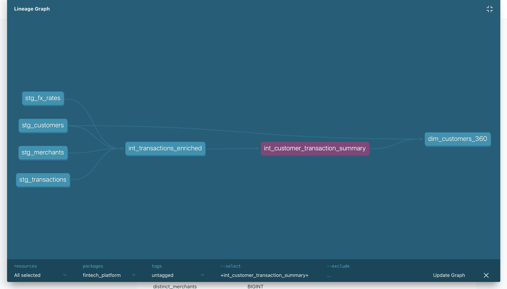

# Fintech Payments Analytics Platform

A production-grade data engineering portfolio project demonstrating the full modern data stack — from raw data ingestion through to business-ready analytics marts — built entirely with open-source, free tooling.

---

## What This Is

This project models the analytics infrastructure of a fictional UK-based fintech company processing payments across multiple currencies, channels, and merchant categories. It covers the three core problems every fintech data team faces:

1. **Payment performance** — how healthy is the payment flow? Where are completions failing?
2. **Customer intelligence** — who are our most valuable customers, and who is about to churn?
3. **Risk and fraud** — which merchants and customers represent elevated risk?

The answer to each question lives in a clean, tested, documented mart — built on a layered dbt architecture over DuckDB.

---

## Stack

| Layer | Tool | Why |
|---|---|---|
| Data Warehouse | **DuckDB** | Columnar, embedded, handles 150k+ rows without a server. Used in production at several fintechs. |
| Transformation | **dbt Core** | Industry-standard. Staging → Intermediate → Mart layers with full lineage. |
| Data Generation | **Python + Faker** | 150,000 synthetic transactions across 2,000 customers, 300 merchants, 6 currencies. |
| CI/CD | **GitHub Actions** | Runs `dbt build` (run + test) on every push and PR. |
| Language | **SQL + Python** | |

---

## Project Structure

```
fintech_platform/
│
├── scripts/
│   └── generate_data.py          # Synthetic data generator → seeds DuckDB
│
├── data/
│   ├── raw/                      # CSV exports (gitignored: .duckdb file)
│   └── fintech.duckdb            # Local warehouse (regenerated by script)
│
├── fintech_dbt/
│   ├── models/
│   │   ├── staging/              # Source → clean typed views (1:1 with source tables)
│   │   │   ├── stg_customers.sql
│   │   │   ├── stg_merchants.sql
│   │   │   ├── stg_transactions.sql
│   │   │   ├── stg_fx_rates.sql
│   │   │   ├── stg_disputes.sql
│   │   │   └── sources.yml
│   │   │
│   │   ├── intermediate/         # Business logic, joins, reusable aggregations
│   │   │   ├── int_transactions_enriched.sql      # FX-normalised, fully enriched txn grain
│   │   │   └── int_customer_transaction_summary.sql
│   │   │
│   │   └── marts/                # Business-facing tables (materialised as TABLE)
│   │       ├── payments/
│   │       │   └── fct_monthly_payment_performance.sql
│   │       ├── customers/
│   │       │   ├── dim_customers_360.sql           # LTV, churn risk, engagement score
│   │       │   └── fct_cohort_retention.sql        # Monthly cohort retention matrix
│   │       └── risk/
│   │           ├── fct_fraud_events.sql            # INCREMENTAL model
│   │           └── dim_merchant_risk_scorecard.sql # Composite risk scoring
│   │
│   ├── macros/
│   │   └── finance_utils.sql     # safe_divide, pct_of_total, convert_currency, date_spine
│   │
│   ├── analyses/
│   │   └── executive_insights.sql  # 7 business questions answered in SQL
│   │
│   ├── dbt_project.yml
│   └── profiles.yml
│
└── .github/
    └── workflows/
        └── dbt_ci.yml            # CI: generate data → dbt build → dbt test
```

---

## Data Model

### Lineage

```
raw.customers  ─────────────────────────────────────────────────────┐
raw.merchants  ──────────────────────────────────────────────────┐  │
raw.fx_rates   ──────────────────────────────────────────────┐   │  │
raw.disputes   ─────────────────────────────────────────┐    │   │  │
raw.transactions ────────────────────────────────────┐  │    │   │  │
                                                     │  │    │   │  │
              stg_transactions ◄────────────────────┘  │    │   │  │
              stg_disputes     ◄───────────────────────┘    │   │  │
              stg_fx_rates     ◄────────────────────────────┘   │  │
              stg_merchants    ◄────────────────────────────────┘  │
              stg_customers    ◄───────────────────────────────────┘
                    │
                    ▼
        int_transactions_enriched          ← FX normalisation, risk tier, full enrichment
        int_customer_transaction_summary   ← pre-aggregated customer stats
                    │
          ┌─────────┼──────────────┐
          ▼         ▼              ▼
  fct_monthly    dim_customers  fct_fraud_events        (INCREMENTAL)
  _payment       _360           dim_merchant_risk
  _performance   fct_cohort     _scorecard
                 _retention
```

### Key Design Decisions

**Why separate staging and intermediate?**
Staging models are a 1:1 mapping of source tables — clean types, renamed columns, nothing more. This means if a source changes, you fix it in one place. Business logic (joins, FX conversion, aggregations) lives exclusively in intermediate and marts.

**Why is `fct_fraud_events` incremental?**
In production, fraud detection runs continuously against a stream of new transactions. The incremental materialisation pattern means only new rows since the last run are processed — critical when you're working at scale. The 30-day velocity window (`count(*) over (partition by customer_id order by transaction_at range between interval '30 days' preceding and current row)`) is a real-world fraud signal.

**Why GBP normalisation in intermediate, not staging?**
FX conversion requires a join to `stg_fx_rates` on date + currency. Doing this in staging would violate the principle that staging models are single-source. The intermediate layer is where multi-source enrichment belongs.

**Why reusable macros?**
`safe_divide`, `pct_of_total`, and `convert_currency` are used across multiple models. Writing them as macros means one definition, consistent behaviour everywhere, and easy testing.

---

## Business Metrics Built

### Payment Performance (`fct_monthly_payment_performance`)
- Total Payment Volume (TPV) in GBP — monthly, by currency and channel
- Completion rate, decline rate, fraud rate
- Month-on-month volume growth
- FX exposure by currency

### Customer Intelligence (`dim_customers_360`)
- **LTV Tier**: Platinum / Gold / Silver / Bronze based on total GBP spend
- **Churn Risk Segment**: Active / Cooling / At Risk / Churned (based on recency)
- **Engagement Score**: composite of active months, category breadth, transaction frequency
- **Customer 360**: disputes, fraud flags, channel mix, tenure — all in one row

### Cohort Retention (`fct_cohort_retention`)
- Classic M0–M12 retention matrix by signup cohort
- Shows what % of each month's signups were still transacting N months later

### Risk (`fct_fraud_events`, `dim_merchant_risk_scorecard`)
- Fraud events with dispute outcome and 30-day velocity signal
- Per-merchant composite risk score (fraud rate + dispute rate + inherent risk)
- Risk bands: Critical / Elevated / Standard

---

## Sample Results (from 150k transactions, 2023–2024)

| Metric | Value |
|---|---|
| Monthly TPV (avg) | ~£420,000 GBP |
| Overall completion rate | ~92% |
| Fraud flag rate | ~1.9% |
| Total fraud events detected | 2,881 |
| Total disputed amount | £217,134 GBP |
| Customers at churn risk | ~100% (data ends Dec 2024, expected) |

---

## Getting Started

```bash
# 1. Clone and install
git clone https://github.com/your-username/fintech-platform.git
cd fintech-platform
pip install -r requirements.txt

# 2. Generate data and seed the warehouse
python scripts/generate_data.py

# 3. Run the full dbt pipeline
cd fintech_dbt
dbt run --profiles-dir .

# 4. Run all tests (30 tests across sources and marts)
dbt test --profiles-dir .

# 5. Generate and serve documentation
dbt docs generate --profiles-dir .
dbt docs serve --profiles-dir .
# Open http://localhost:8080 — full lineage graph + model docs
```

---

## dbt Tests

30 data quality tests across all layers:

- **Uniqueness** on all primary keys
- **Not null** on all critical fields
- **Accepted values** on all categorical fields (status, risk_band, ltv_tier, etc.)
- **Source freshness** configuration ready for production use

Run with: `dbt test --profiles-dir .`

---

## CI/CD

Every push to `main` or `develop` triggers:
1. Python environment setup + dependency install
2. `python scripts/generate_data.py` — seeds a fresh DuckDB
3. `dbt build` — runs all 12 models + 30 tests in a single command
4. Uploads dbt artifacts (manifest, run_results) for lineage inspection

See `.github/workflows/dbt_ci.yml`.

---

## What This Demonstrates

| Skill | Where |
|---|---|
| dbt layered architecture (staging → intermediate → mart) | All models |
| Incremental materialisation | `fct_fraud_events` |
| Reusable SQL macros | `macros/finance_utils.sql` |
| Window functions (velocity, cohort, MoM growth) | Multiple marts |
| FX normalisation across currencies | `int_transactions_enriched` |
| Data quality testing | `sources.yml`, `schema.yml` |
| Business metric design (LTV, churn, cohort, risk score) | Mart layer |
| GitHub Actions CI | `.github/workflows/dbt_ci.yml` |
| Large dataset handling (150k rows, columnar warehouse) | DuckDB |
| Executive analytical thinking | `analyses/executive_insights.sql` |

---

## Lineage



## Author

**MD Tanvir Anjum** 
[linkedin.com/in/mdtanviranjum21](https://linkedin.com/in/mdtanviranjum21)
